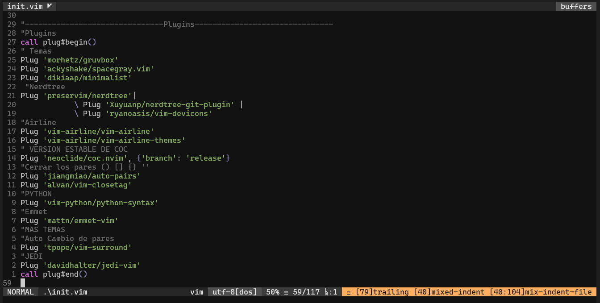

# Teo Dev Configuración NeoVim


Esta configuración para que se apliquen los Ajustes debe estar Instalado **PowerLine Fonts** y **Vim** Plug

## Aquí una Captura de como se verá



## Plugins Instalados

```
​```
" Temas
 Plug 'morhetz/gruvbox'
Plug 'sainnhe/sonokai'
Plug 'ayu-theme/ayu-vim'
Plug 'sheerun/vim-polyglot'
 " Fern
Plug 'lambdalisue/fern.vim'
Plug 'antoinemadec/FixCursorHold.nvim'
Plug 'lambdalisue/fern-renderer-nerdfont.vim'
Plug 'lambdalisue/nerdfont.vim'
Plug 'lambdalisue/glyph-palette.vim'
Plug 'lambdalisue/fern-git-status.vim'
"FERN ICONS
Plug 'ryanoasis/vim-devicons'
"Airline
Plug 'vim-airline/vim-airline'
Plug 'vim-airline/vim-airline-themes'
" VERSION ESTABLE DE COC
Plug 'neoclide/coc.nvim', {'branch': 'release'}
"Cerrar los pares () [] {} '' 
Plug 'jiangmiao/auto-pairs'
Plug 'alvan/vim-closetag'
"       "PYTHON
Plug 'hdima/python-syntax'
"Auto Cambio de pares
Plug 'tpope/vim-surround'
"       "Git Fugitive
Plug 'tpope/vim-fugitive'
"       "Indent 
Plug 'yggdroot/indentline'
"       "FUZZY FINDER
Plug 'junegunn/fzf', { 'do': { -> fzf#install() } }
Plug 'junegunn/fzf.vim'
"       "NERD COMMENTER
Plug 'preservim/nerdcommenter' 
"Bracket Coloraizer
Plug 'luochen1990/rainbow'
​```
```

### Explicación de los Plugins

**TEMAS**

> Gruvbox (Tema Actual)
>
> Sonokai
>
> Ayu

**EXPLORADOR DE ARCHIVOS**

> **FERN PLUGINS**
>
> 1. fern-renderer-nerdfont.vim `(Añadir iconos a Fern con NerdFont)`
> 2. FixCursorHold.nvim `(Arregla el cursor de Fern )`
> 3. nerdfont.vim `(Adapta las fuentes NerdFont a Vim)`
> 4. glyph-palette.vim`(Adapta el tema actual a Fern)`
> 5. fern-git-status.vim`(Soporte para los iconos en general)`
> 6. vim-devicons`(Iconos para Fern y Airline)`

**UTILIDADES**

> **BARRA DE ESTADO**
>
> 1. vim-airline/vim-airline
> 2. vim-airline/vim-airline-themes

> **AUTOCOMPLETADO**
>
> 1. neoclide/coc.nvim
> 2. jiangmiao/auto-pairs
> 3. alvan/vim-closetag
> 4. hdima/python-syntax
> 5. tpope/vim-surround
> 6. tpope/vim-fugitive
> 7. junegunn/fzf
> 8. junegunn/fzf.vim
> 9. preservim/nerdcommenter
> 10. luochen1990/rainbow

## Agradecimientos

Solo te quiero decir Gracias por ver esta configuración

#### Saludos desde Ecuador :thumbsup: :star:
