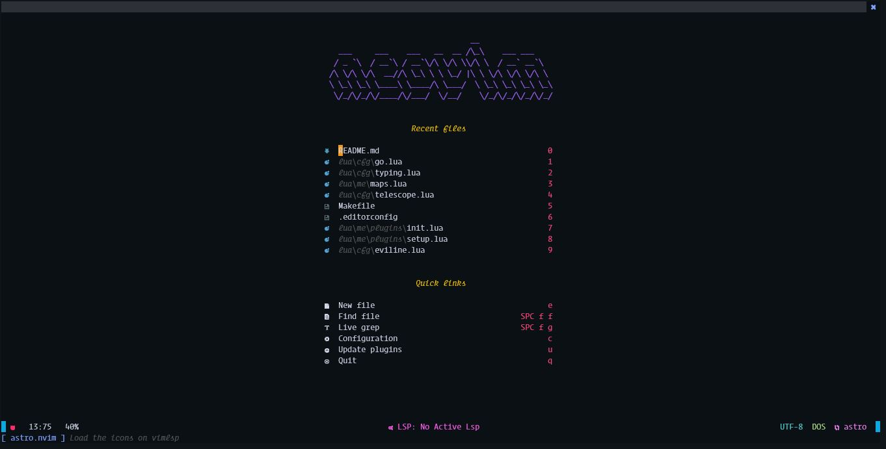

## astro.nvim :new_moon:

<div align="center">

</div>

This is my personal version _not distro, not issues_ **only for my personal use
and as reference for write a new config**

### Requirements :books:

- [Git](https://git-scm.com)
- Gcc
- Curl

> More detailed installation [here](#Markdown)

- Pandoc
- Npm Live Server

### Installation :package:

- Install Windows :window:

```ps1
git clone https://github.com/TeoDev1611/astro.nvim $HOME/AppData/Local/nvim --depth 1
nvim +JetpackInstall
# With this you install the Plugin Manager after that you 
# need run JetpackSync in neovim or quit and run:
nvim +JetpackSync
```

- Install Linux :penguin: MacOS :apple:

```
git clone https://github.com/TeoDev1611/astro.nvim $HOME/.config/nvim --depth 1
nvim +JetpackInstall
# With this you install the Plugin Manager after that you 
# need run JetpackSync in neovim or quit and run:
nvim +JetpackSync
```

### Markdown

For use the `MarkdownPreview` you need install this:

- Pandoc:

  - Install Windows :window:
  ```ps1
  scoop install pandoc
  ## Or with chocolatey!
  choco install pandoc
  ```
- Install MacOS :apple:
  ```
  brew install pandoc
  ```
- Install Linux :penguin:
  ```sh
  sudo apt install pandoc
  # Or for fedora:
  sudo dnf install pandoc
  ## For the other distros check in pandoc.org
  ```
- Npm Live server

> :warning: You need have installed [node](https://nodejs.org) and npm

```
npm install -g --force @compodoc/live-server
```

### Versions :mega:

This version works with Lua with Packer as package manager, check **nightly**
for other version! Updated and improved with new tools!

> Always a WIP :alien:

---

Made with :heart: in Ecuador
