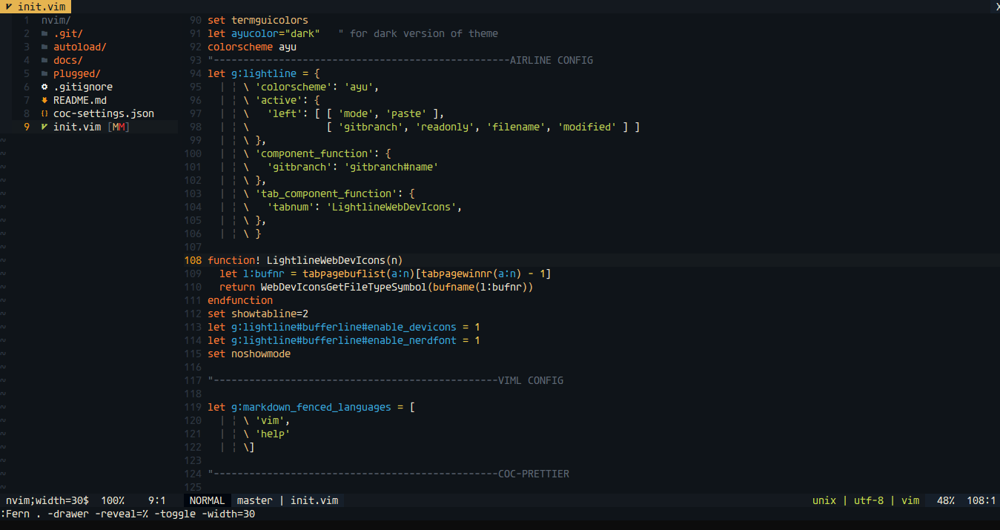
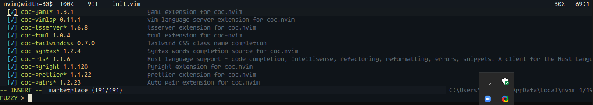
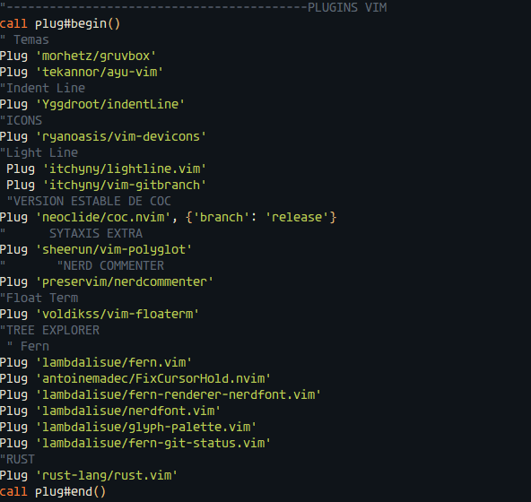

# Teo Dev Configuración NeoVim

Esta configuración para que se apliquen los Ajustes debe estar Instalado **PowerLine Fonts** y **Vim** Plug

## Aquí una Captura de como se verá

## Plugins

COC PLUGINS:

VIM PLUG PLUGINS:

## Agradecimientos

Solo te quiero decir Gracias por ver esta configuración

#### Saludos desde Ecuador :thumbsup: :star:

### DOCUMENTACIÓN DESACTUALIZADA

