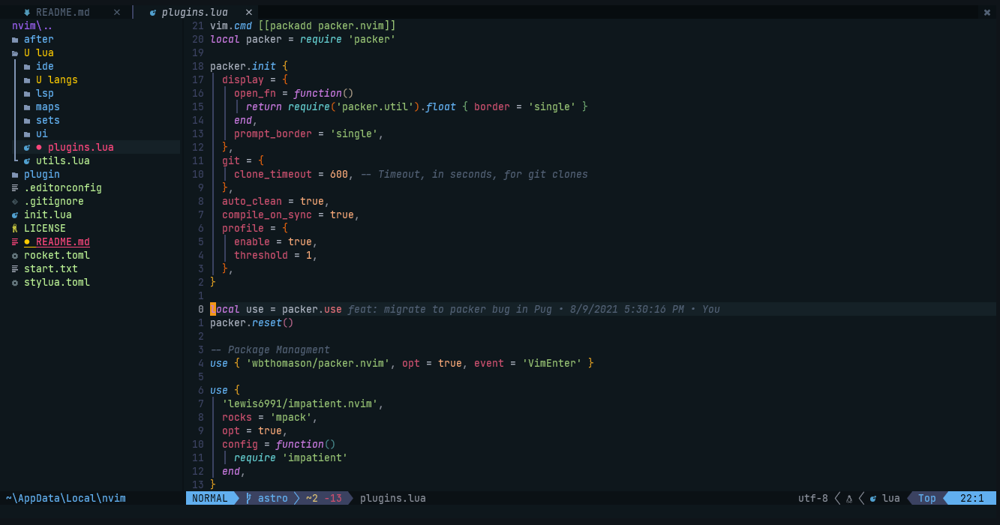

astro.nvim -> Neovim Config
===========================

---

Here you found me neovim config

What is this?
-------------

Here you found a neovim config based in lua for Neovim

Screenshots
-----------

Requirements for install this?
------------------------------

-	Git
-	Neovim 0.5+
-	RipGrep
-	Fd

How can install this?
---------------------

Go to your Neovim Config directory

-	MacOS and Linux `cd $HOME/.config/nvim`

-	Windows Powershell `cd "$env:LOCALAPPDATA\nvim"`

After this you need clone the repository with this command `git clone -b astro https://github.com/TeoDev1611/AstroVim.git .`

And enter to Neovim and run `:PackerSync`

### Automaticall script?

Working in this if you want more this faster can you make a pull request

### Markdown support

This config have support for preview Markdown with live reload you need make this:

-	Open any Markdown file `nvim README.md`
-	Run this command into the Markdown file `call mkdp#util#install()`

And done! you need run this for preview `MarkdownPreview`

---

Made with :heart: in Ecuador
