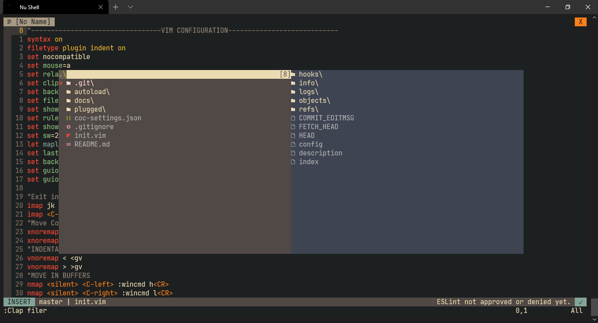

# My Portable Neovim Config

For install this configuration you need a NerdFont and Vim-Plug

## An example Screen Shot 

## How install

1. Clone my repository

2. Paste in your folder

3. Install Vim Plug

4. Run the command PlugInstall

5. Exit of vim or neovim and all is installed

#### Hi from Ecuador :thumbsup: :star:

